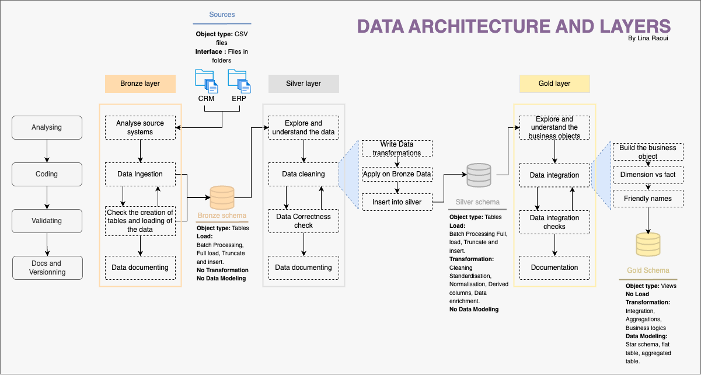

#  Retail Sales Data Warehouse Project

Welcome to my first end-to-end data warehouse project!  
This project showcases how to build a modern **retail sales data warehouse** using **PostgreSQL**, with layered architecture, structured ETL pipelines, and analytical queries inspired by [@DataWithBaraa](https://github.com/DataWithBaraa)’s excellent tutorial.

---

## 📌 Table of Contents

- [Project Overview](#project-overview)  
- [Tech Stack](#tech-stack)  
- [Architecture](#architecture)  
- [Schema Design](#schema-design)  
- [ETL Pipeline](#etl-pipeline)  
- [Key Analytics](#key-analytics)
- [Focus Areas](#focus-areas) 
- [Credits](#credits)
- [Final Note](#final-note)  

---

## Project Overview

This project simulates a retail business environment where sales data from **CRM** and **ERP** systems (CSV files) is integrated into a centralized **data warehouse** to support **analytics and business reporting**.

It follows the **Medallion Architecture**:
- **Bronze Layer**: Raw data ingestion from source CSVs  
- **Silver Layer**: Cleaned and standardized data  
- **Gold Layer**: Star schema modeled for analytical performance  

---

## Tech Stack

- **PostgreSQL** – Data warehouse backend  
- **SQL** – Scripting & Querying  
- **Draw.io** – For architecture and data flow diagrams  
- **Git & GitHub** – Version control and documentation  

---

## Architecture

> The project uses the medallion architecture, a layered approach for separation of concerns and scalability.

---

## Schema Design

**Fact Table**
- `fact_sales` – Central table for transactions

**Dimension Tables**
- `dim_product`
- `dim_customer`
- `dim_store`
- `dim_date`

The schema follows the **star model**, optimized for fast analytical queries.

---

## ETL Pipeline

The pipeline consists of three stages:

- **Extract**  
  Load raw CRM and ERP CSV files into PostgreSQL `bronze` tables

- **Transform**  
  Clean and prepare data: handling nulls, fixing types, standardizing formats

- **Load**  
  Insert cleaned data into `silver` and finally into `gold` star schema tables

Scripts are modularized into:
- `scripts/bronze/`  
- `scripts/silver/`  
- `scripts/gold/`

---

## Key Analytics

Some of the business questions answered by SQL queries:

- Total sales by store and region  
- Best-selling products per quarter  
- Monthly and seasonal sales trends  
- Customer segmentation by purchase frequency

---

## Focus Areas

| Area             | Focus Level |
|------------------|-------------|
| Ingestion        | ██████░░░░ 60% |
| Storage          | █████████░ 90% |
| Modeling         | ████████░░ 80% |
| ETL / ELT        | ██████░░░░ 60% |
| Orchestration    | ███░░░░░░ 30% |
| Data Quality     | █████░░░░░ 50% |
| Infrastructure   | ██████░░░░ 60% |

---

## Credits

- **Inspired by**: [@DatawithBaraa’s Data Warehouse Tutorial](https://www.youtube.com/watch?v=9GVqKuTVANE&list=PLw82ykBiRKZfoW21VNpOz18qV4njiRrwy&index=2) 🙏 
- **Certification**: [DataCamp Associate Data Engineer](https://www.datacamp.com/certification/associate-data-engineer)  
- **Developed by**: [Lina Raoui](https://www.linkedin.com/in/lina-raoui-2a5747191)

---

## Final Note

"Beyond the technical skills, this project helped me understand how to structure a data engineering solution entirely with SQL from raw data to business-ready analytics.  
It also taught me the importance of documentation, planning, and clean architecture, lessons I’ll continue applying in all future projects."

---
